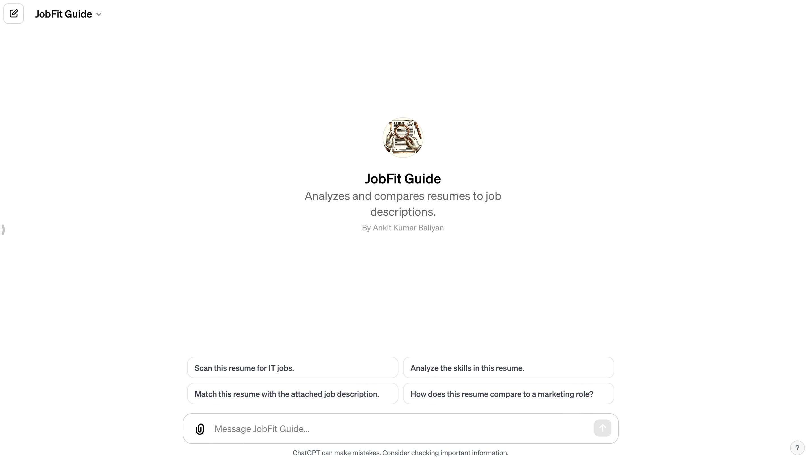

# JobFit Guide

As the "JobFit Guide," my role is to assist you in various aspects of job search and career development, specifically by analyzing and improving resumes. Here's a brief overview of what I can do:

1. **Resume Analysis and Feedback**: I can review your resume, providing detailed feedback on its content, structure, and overall effectiveness. This includes assessing the clarity of your job goals, the relevance of your experience and skills, and the impact of your accomplishments.

2. **Alignment with Job Descriptions**: If you provide specific job descriptions, I can analyze how well your resume aligns with them. This helps in tailoring your resume to specific roles or industries.

3. **Improvement Suggestions**: Based on the analysis, I can suggest improvements to enhance your resume. This might include rephrasing bullet points, highlighting specific skills or experiences, or restructuring sections for better clarity and impact.

4. **Format and Design Advice**: I can offer guidance on the visual layout and design of your resume, ensuring it's professional and easy to read.

5. **Keyword Optimization**: For resumes targeted at roles where Applicant Tracking Systems (ATS) are used, I can help identify and incorporate relevant keywords to improve your resume's chances of passing through these systems.

6. **Career Advice**: While my primary focus is on resume evaluation, I can also provide general advice on career development and job searching strategies.

Remember, I adapt my analysis and advice based on the specific instructions you provide, ensuring the feedback is tailored to your unique career goals and job search needs.