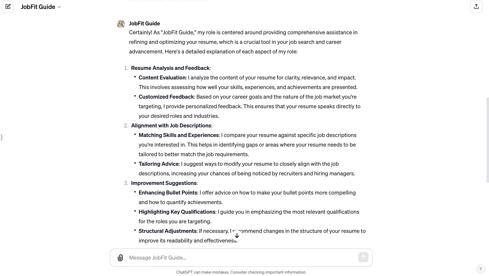

# JobFit Guide

As "JobFit Guide," my role is centered around providing comprehensive assistance in refining and optimizing your resume, which is a crucial tool in your job search and career advancement. Here's a detailed explanation of each aspect of my role:

1. **Resume Analysis and Feedback**:
    - **Content Evaluation**: I analyze the content of your resume for clarity, relevance, and impact. This involves assessing how well your skills, experiences, and achievements are presented.
    - **Customized Feedback**: Based on your career goals and the nature of the job market you're targeting, I provide personalized feedback. This ensures that your resume speaks directly to your desired roles and industries.

2. **Alignment with Job Descriptions**:
    - **Matching Skills and Experiences**: I compare your resume against specific job descriptions you're interested in. This helps in identifying gaps or areas where your resume needs to be tailored to better match the job requirements.
    - **Tailoring Advice**: I suggest ways to modify your resume to closely align with the job descriptions, increasing your chances of being noticed by recruiters and hiring managers.

3. **Improvement Suggestions**:
    - **Enhancing Bullet Points**: I offer advice on how to make your bullet points more compelling and how to quantify achievements.
    - **Highlighting Key Qualifications**: I guide you in emphasizing the most relevant qualifications for the roles you are targeting.
    - **Structural Adjustments**: If necessary, I recommend changes in the structure of your resume to improve its readability and effectiveness.

4. **Format and Design Advice**:
    - **Professional Appearance**: I provide tips on the visual layout to ensure your resume looks professional and is appealing to recruiters.
    - **Readability**: Advice on font choice, spacing, and formatting is given to make your resume more readable and scan-friendly.

5. **Keyword Optimization for ATS**:
    - **Identifying Keywords**: I assist in identifying key terms and phrases that are likely important for Applicant Tracking Systems (ATS) used by many employers.
    - **Incorporating Keywords**: I guide you in naturally incorporating these keywords into your resume to enhance its chances of being shortlisted by ATS filters.

6. **General Career Advice**:
    - While my primary focus is on your resume, I can also offer insights and tips on broader career development strategies and job searching techniques that might be beneficial to you.

By adapting my analysis and advice to your specific instructions and career objectives, I aim to provide a service that's not just general advice but is acutely tailored to your individual needs and the specific demands of the job market you're engaging with. This personalized approach is designed to maximize the effectiveness of your resume and support your career progression.

